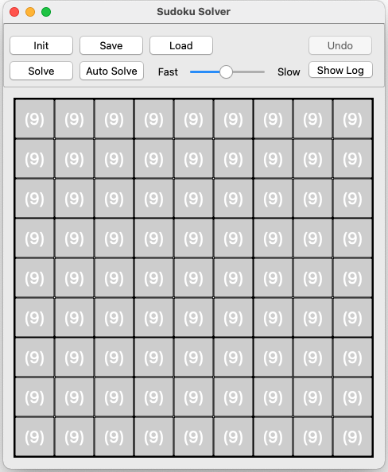
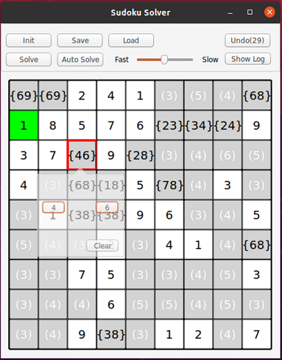

# Sudoku Solver as Firemonkey Cross-Platform Application

## Introduction 

This is a Delphi learning project prepared for Delphi 12.3 Athens. This application is prepared to run on Windows 32/64, and on MacOS 64, and on Linux64 for Intel/AMD, and on Android and on iOS devices. 

Thanks to the integrated half-solver, all 3 rules are continuously checked during input and only those digits are automatically available that do not cause rule conflicts.

Since December 2020, a full solver based on the backtracking algorithm has been added. It is used to explain the simplicity of this algorithm to the students.

## Precondition

1. You can start with the Community Edition of Delphi. See also [www.embarcadero.com/products/delphi/starter/free-download](https://www.embarcadero.com/products/delphi/starter/free-download)

2. You should be familiar with the rules of the math game sudoku. See also [en.wikipedia.org/wiki/Sudoku](https://en.wikipedia.org/wiki/Sudoku)

## Getting started
1. Clone this repo;
2. Open the project _Sudoku.dpr_ in the Delphi IDE;
3. Press menu command Run in the Delphi IDE;

4. Click in a number field __(9)__ and select the first digit according to your first Sudoku example;
5. Enter field by field until all of the predefined fields are filled out;
6. Hint during entering the fields: For a simple Sudokus, the half-solver automatically fills all digits with the background color green as soon as only one digit can be selected;
7. After filling in all the predefined fields, you can start to solve the Sudoku;
8. Hint for solving: Begin with the smaller sets and choose a digit. Check the impact of your selected option in the matrix;
9. In the case of a rule violation, you can use the undo button;
10. The button __Init__ let you start a new game;
11. The button __Save__ let you store the current matrix into a text file;
12. With the button __Load__ you can restore the former game stage.
13. If the half solver makes your Sudokus too easy, dare to load the ExpertExample.txt.

## Hint for field visualzation
* (3..9): Number of selectable digits;
* {Digit1, Digit2}: If only two digits can be selected, these are displayed directly as a set;
* Field with border color __red__: Selected field in order to choose a digit;
* Field with back color __white__: Entered digit;
* Field with back color __green__: Calculated digit;
* Filed with back color __blue__: Selected (tried) digit by the auto solver;
* Field with back color __pink__: Role conflict in the horizontal line, the vertical line or within the 3x3 box.

## Using the Auto Solver

Pressing the __Solve__ button executes a single solver step. 

The algorithm searches for the number field with the smallest variability starting from the upper left edge. I.e. it selects the number field that has only 2 possible digits or the number field with the smallest set of digits. 

In the second step, the first available digit from this field is tentatively selected and checked if it does not trigger a rule violation in the half-solver. In case of a rule violation, the previous digit choice must be reversed. This digit must not be tried again in a next solver step.

The __Auto Solve__ button can be used to automatically repeat the solving steps until a final Suduko configuration is reached. Thereby the solving speed can be selected. A log informs about each solver step.

Have fun solving Sudokus and understanding the backtracking algorithm.

Christoph Schneider, Schneider Infosystems AG, Switzerland 
[schneider-infosys.ch](https://www.schneider-infosys.ch)
